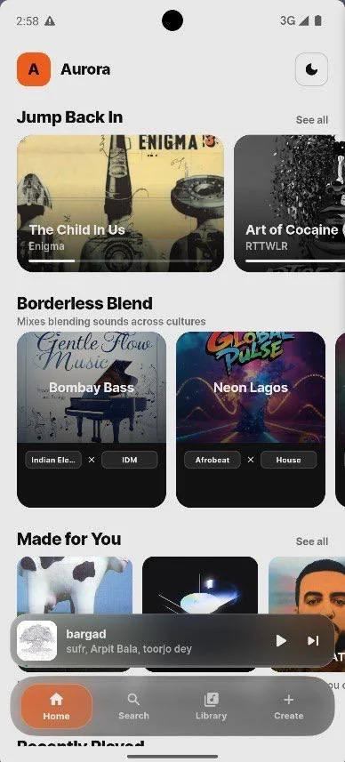
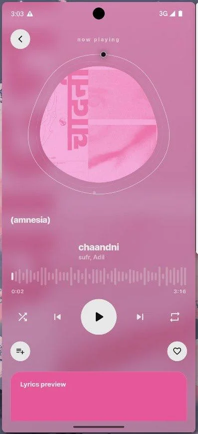
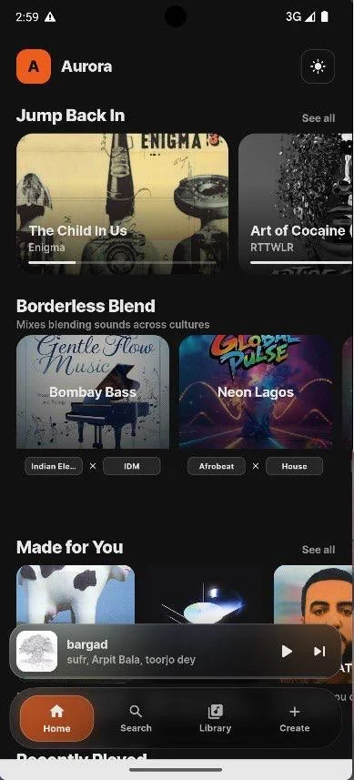
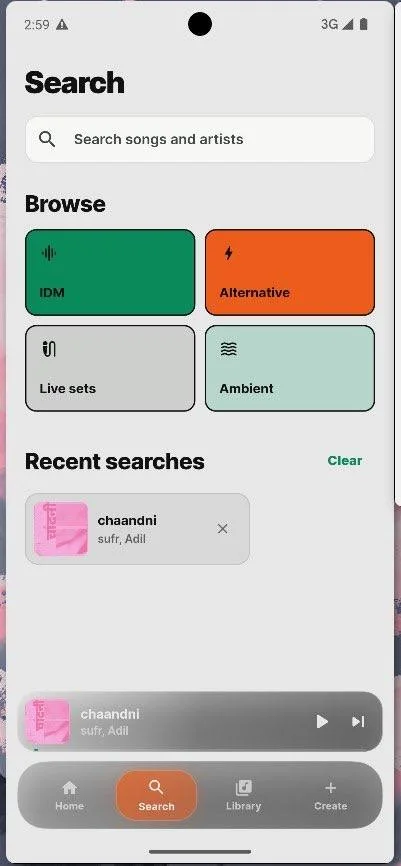
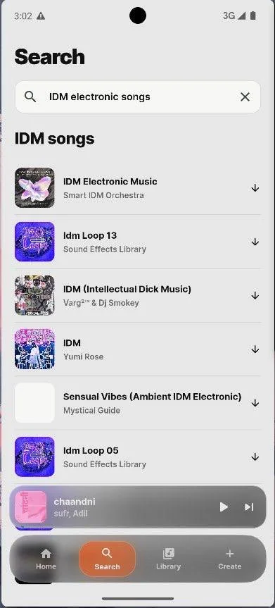
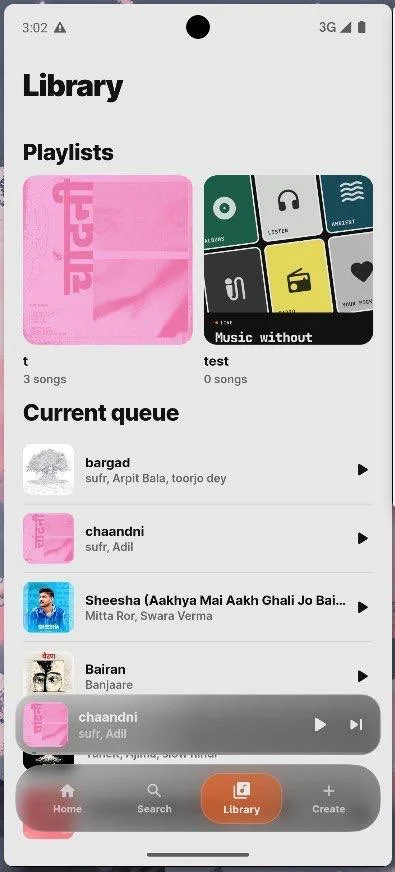
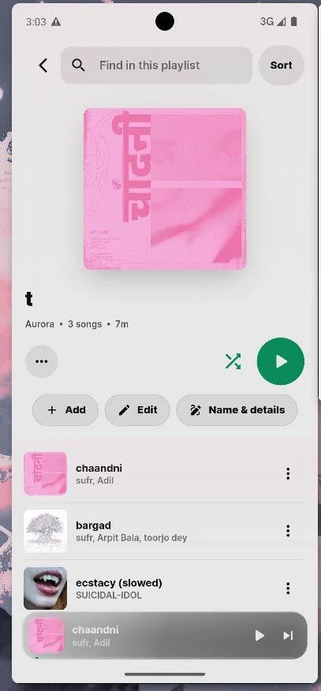
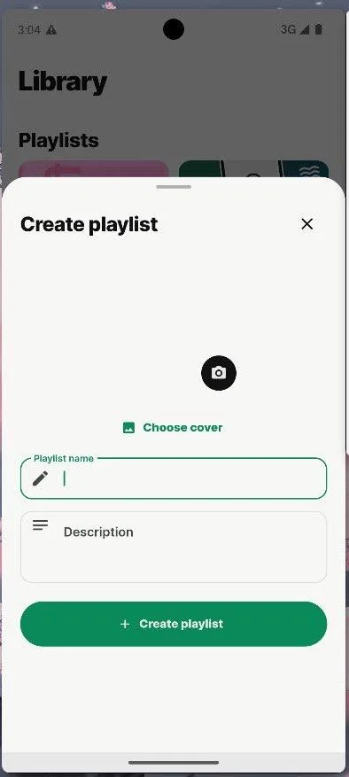
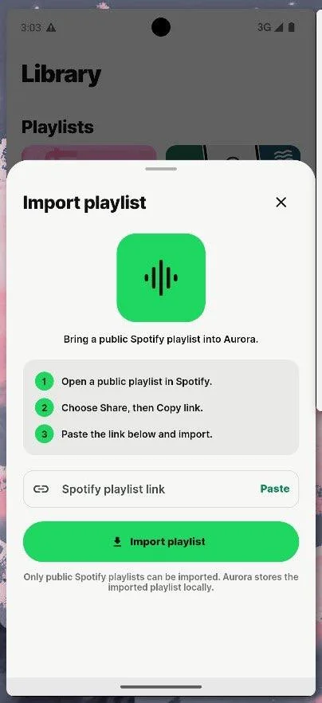

# Aurora

**Music without borders.**

An artwork-first music experience for Android, shaped by adaptive color,
personal taste, and fluid playback.

  
  
  

## Made for listening

- **Artwork first:** bold visuals, adaptive colors, and motion that follows the music
- **Personal from the start:** choose what you enjoy and shape your recommendations
- **Easy to explore:** search tracks, albums, artists, and playlists in one place
- **Playlists without friction:** create, edit, and import public Spotify playlists
- **Playback in your hands:** manage the queue, seek, shuffle, repeat, and listen in the background
- **Your preferred mood:** switch between light, dark, and AMOLED themes

## Find your next track

Browse by sound, return to recent searches, or go directly from results to
playback without losing your place.

  
  

## Build a library that stays useful

Keep playlists and the current queue together, then create a collection from
scratch or bring in a public playlist link.

  
  

  
  

## Get Aurora

1. Open the **[latest release](https://github.com/rgjny/aurora-releases/releases/latest)**.
2. Expand **Assets** and download `Aurora-vX.Y.Z.apk`.
3. Open the downloaded file on your Android device.
4. Allow installs from your browser or file manager if Android asks, then choose **Install**.

> [!IMPORTANT]
> GitHub adds `Source code` archives to every release automatically. Those are
> not the Android app. Download the file ending in `.apk`.

### Updating

Download the newer APK and install it over your current version. You do not
need to uninstall Aurora first.

## The release channel

This repository is Aurora's official public distribution home. Signed Android
builds and release notes live on the
**[Releases](https://github.com/rgjny/aurora-releases/releases)** page, keeping
every public version easy to find and verify.

Aurora is currently distributed for Android.
